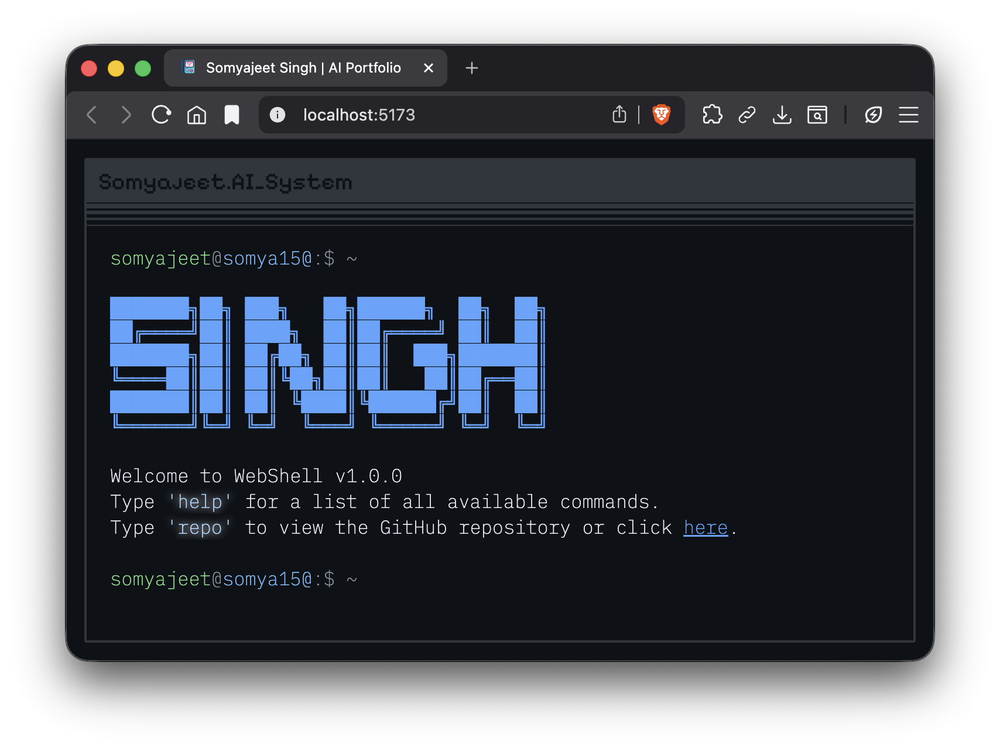

# Webterm - Somyajeet Singh
<div align="center">
  
</div>


Terminal-style portfolio website for Somyajeet Singh, showcasing projects in AI, ML, and Creative Systems. Note: This project has been rebranded from **Webshell** to **Webterm**.

## Features
* **Interactive Terminal**: Type commands like a pro.
* **sidebar GUI**: Rapid navigation buttons on the right for About, Projects, Education, etc.
* **Random Theme**: Click 'THEME' to instantly cycle through available color schemes.
* **Mobile Optimized**:
    * **Calculated Scroll**: Autos-scrolls to keep your input visible.
    * **Click-to-Type**: Tap the terminal background to bring up the keyboard (prevents auto-popup annoyance).
* **[Tab]** for auto completion.
* **[Esc]** to clear the input line.
* **[↑][↓]** to scroll through your command history.

## Commands
* `help`: List all available commands.
* `about`: Display information about the user.
* `projects`: View user's projects.
* `whoami`: Display current user session info.
* `education`: View educational background.
* `skills`: View technical skills.
* `banner`: Display the startup banner.
* `clear`: Clear the terminal screen.
* `resume`: Open resume in a new tab.
* `linkedin`: Open LinkedIn profile.
* `github`: Open GitHub profile.
* `email`: Open default email client.
* `ls`: List files (easter egg).
* `theme [name]`: Change the terminal theme.
* `repo`: Open this project's repository.

## Themes
You can change the look and feel of the terminal using the `theme` command.
Usage: `theme [name]`

Available themes:
* `default`: The standard dark theme.
* `matrix`: A Matrix-inspired green theme.
* `dracula`: The famous Dracula theme.
* `gruvbox`: A retro groove color scheme.
* `nord`: An arctic, north-bluish color palette.

## Configuration

Most of the configuration is done in the `config.json` file. You can customize:

* **ascii**: The ASCII art banner shown on startup.
* **title**: The title of the page.
* **social**: Links to your social profiles (GitHub, LinkedIn, Email).
* **colors**: Customize the color scheme (background, foreground, prompt, etc.).
* **education**: List of educational qualifications.
* **skills**: Categorized list of skills (languages, web, ai_ml, tools).
* **projects**: List of projects with descriptions and links.

```json
{
  "ascii": [ " ... " ],
  "title": "Somyajeet Singh",
  "social": {
    "email": "...",
    "github": "...",
    "linkedin": "..."
  },
  "colors": {
    "background": "#0D1117",
    "foreground": "#E6EDF3",
    "banner": "#58A6FF"
    // ...
  }
}
```

## Hidden Commands (Easter Eggs)
There are a few hidden interactions to discover:
* Try using `sudo`.
* Be careful with `rm -rf`.

## Run the Project Locally:

Clone the repository
```shell
git clone https://github.com/ssgamingop/portfolio.git
```
Go to the project directory
```shell
cd portfolio
```
Install the dependencies
```shell
npm install
```
Start the server
```shell
npm run dev
```
