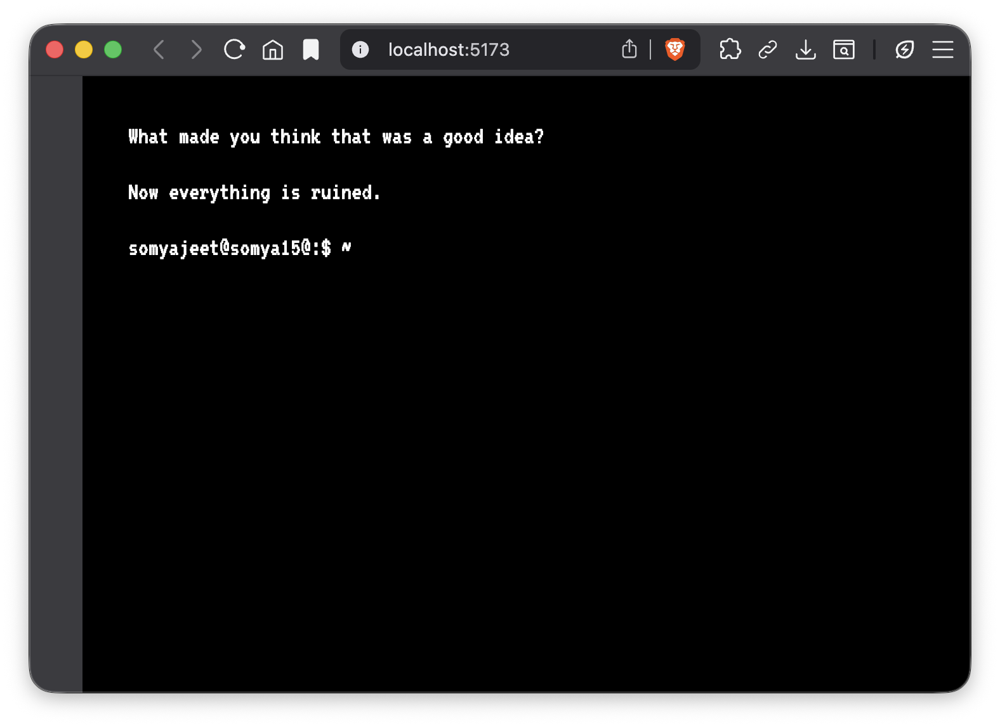

# Somyajeet Singh | AI & ML Portfolio

<div align="center">
  
</div>


Terminal-style portfolio website for Somyajeet Singh, showcasing projects in AI, ML, and Creative Systems.


## Features
* **[Tab]** for auto completion.
* **[Esc]** to clear the input line.
* **[↑][↓]** to scroll through your command history.
* **Custom Commands:** `education`, `skills`, `projects`, `about`

## Fun
<div align="center">
  
</div>

## Configuration

Most of the configuration is done in the `config.json` file.

```json
{
  "ascii": [
    " ... "
  ],
  "title": "Somyajeet Singh",
  "education": [ ... ],
  "skills": { ... },
  "projects": [ ... ]
}
```

## Run the Project Locally:

Clone the repository
```shell
git clone https://github.com/ssgamingop/portfolio.git
```
Go to the project directory
```shell
cd portfolio
```
Install the dependencies
```shell
npm install
```
Start the server
```shell
npm run dev
```
